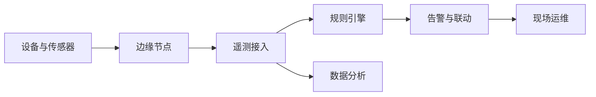
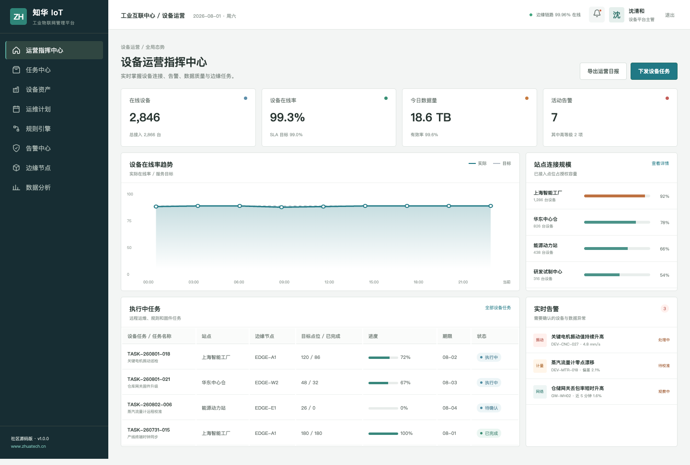
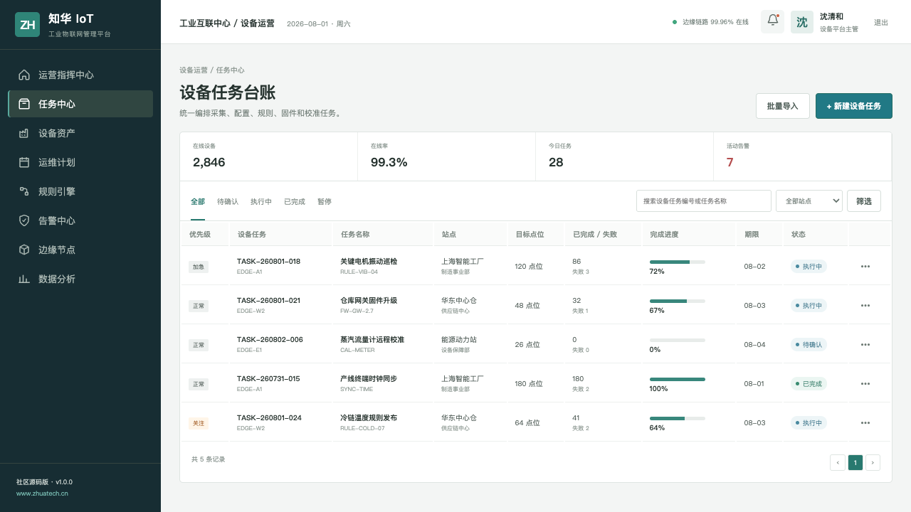
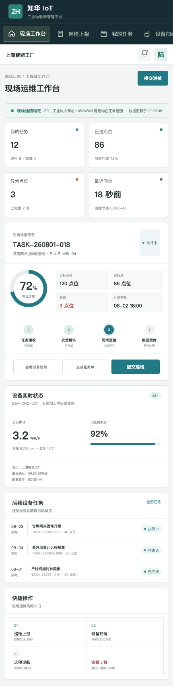

# ZhuaTech IoT

**工业设备连接、遥测、告警与运维协同平台｜社区源码版**

[](backend/pom.xml) [](frontend/package.json) [](LICENSE)

由知华科技（上海如静知华信息科技有限公司）研发并公开源代码。企业工业互联网、边缘计算和设备数字化服务请访问[知华科技官网](https://www.zhuatech.cn/)。

## 平台视角



社区版提供设备台账、站点管理、连接状态、边缘节点、遥测概览、规则任务、实时告警、现场巡检、远程诊断和 JWT 权限基础能力。

## 管理端：知道哪里正在发生什么



指挥中心聚合在线率、数据有效率、设备健康、边缘负荷和活动告警，适合值班大屏与运营人员日常处置。

## 台账：设备不是一串孤立编号



设备任务支持巡检、校准、配置、规则和固件场景，关联站点、边缘节点、目标点位、失败数和执行进度。

## 现场端：工程师只看当前需要处理的内容



响应式现场端包含任务接收、安全确认、设备扫码、实时数据、巡检上报与告警升级，适配平板和手机。

## 技术基线

- Java 21 / Spring Boot / Spring Security / Spring Data JPA / Flyway
- Vue 3 / Pinia / Vue Router / Axios / Vite
- MySQL 8 / Docker Compose / Nginx
- 工程包名：`cn.zhuatech.iot`
- 演示模式不连接真实 PLC、网关或 MQTT Broker

## 启动演示

```bash
cd frontend
npm install
npm run dev:demo
```

访问 `http://localhost:5173`，平台管理端 `planner / Demo@2026`，现场工程师端 `operator / Demo@2026`。

完整部署：复制 `.env.example` 为 `.env`，替换强密码和 `JWT_SECRET` 后运行 `docker compose up --build`。

## 新增：设备遥测健康评估

新增 `POST /api/admin/telemetry-health`，基于消息到达率、解析错误率、时延、电量、信号强度和最后在线时间计算设备健康分，区分 `HEALTHY`、`DEGRADED`、`CRITICAL` 与 `OFFLINE`，并返回现场排查建议。

## 生产化提示

真实工业现场需增加 MQTT/OPC UA/Modbus 接入、证书认证、边缘缓存、指令审批、网络分区、协议白名单、时序数据库、海量数据归档和高可用设计。本仓库的设备与遥测均为演示数据。

## 非商业许可

仅限个人非商业学习、研究和交流，禁止未经授权的企业内部使用、生产部署、SaaS、销售、交付、收费咨询或品牌替换。商业用途须取得上海如静知华信息科技有限公司书面授权，参见 [LICENSE](LICENSE)。

需要工业协议接入、边缘网关、设备模型或私有化定制，可通过官网或以下二维码联系知华科技：

| 技术咨询 | 商务授权 |
| --- | --- |
|  |  |

SEO：工业物联网平台、IoT 开源源码、设备管理系统、设备数据采集、边缘计算平台、工业互联网、Java IoT、Vue IoT、知华科技。

## 设备预测性维护

新增 `POST /api/iot/insights/predictive-maintenance`，综合振动、温度、错误事件、保养周期和电池状态计算维护风险，输出 `HEALTHY`、`SCHEDULE` 或 `SHUTDOWN`。
